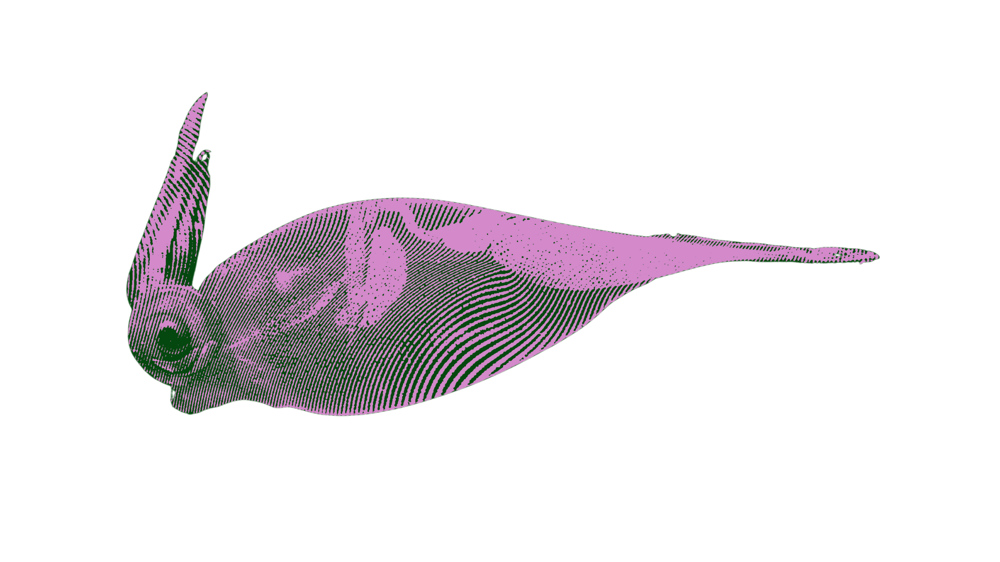

# Timeseries-Analysis-Dashboard

[](https://oceancv.org)
[](https://www.nsf.gov/awardsearch/showAward?AWD_ID=2307504)

Timeseries-Analysis-Dashboard is an open-source visualization and analysis tool for marine data, designed to help researchers, conservationists, and marine scientists explore and analyze underwater data.



## Features

- **Time Series Analysis**: Analyze temporal patterns in marine data
- **Environmental Correlations**: Explore relationships between environmental parameters and biological observations
- **Data Formatting**: Tools for formatting and preparing marine data for analysis
- **Interactive Visualizations**: Built with Streamlit for intuitive, interactive data exploration

## Requirements

- Python 3.8+
- Dependencies listed in `requirements.txt`

## Installation and Setup

### Option 1: Standard Python Installation

1. Clone this repository:
   ```
   git clone https://github.com/AI-Ecology-Lab/Timeseries-Analysis-Dashboard.git
   cd Timeseries-Analysis-Dashboard
   ```

2. Install dependencies:
   ```
   pip install -r requirements.txt
   ```

3. Run the application:
   ```
   streamlit run app.py
   ```

### Option 2: Conda Environment

1. Clone this repository:
   ```
   git clone https://github.com/AI-Ecology-Lab/Timeseries-Analysis-Dashboard.git
   cd Timeseries-Analysis-Dashboard
   ```

2. Create and activate a Conda environment:
   ```
   conda env create -f environment.yml
   conda activate timeseries-dashboard
   ```

3. Run the application:
   ```
   streamlit run app.py
   ```

### Option 3: Docker

1. Clone this repository:
   ```
   git clone https://github.com/AI-Ecology-Lab/Timeseries-Analysis-Dashboard.git
   cd Timeseries-Analysis-Dashboard
   ```

2. Build the Docker image:
   ```
   docker build -t timeseries-dashboard .
   ```

3. Run the application:
   ```
   docker run -p 8501:8501 timeseries-dashboard
   ```

4. Open your browser and navigate to `http://localhost:8501`

## Project Structure

```
Timeseries-Analysis-Dashboard/
├── app.py                 # Main application entry point
├── Dockerfile             # Docker configuration file
├── environment.yml        # Conda environment configuration file
├── LICENSE                # License file
├── README.md              # Project documentation
├── requirements.txt       # Python dependencies
├── style.css              # Global CSS styling
├── assets/                # Images and static assets
│   ├── icon_image.png
│   ├── image.png
│   └── squidbg.png
├── pages/                 # Streamlit pages for different analyses
│   ├── data_formatting.py
│   ├── environmental_correlations.py
│   └── timeseries_analysis.py
├── scripts/               # Utility scripts
│   ├── utils.py
│   └── utils_pagebuttons.py
├── static/                # Static files for web interface
│   ├── css/
│   │   └── style.css
│   └── js/
│       └── interactive.js
├── timeseries/            # Sample data files
│   └── MJ01B_CAMDSB103/
│       └── SHR_2022_2023_fauna_ctd_pressure.csv
└── utils/                 # Helper utilities
    └── helpers.py
```

## Usage

1. Launch the application using one of the methods above
2. Navigate through the sidebar to access different analysis tools:
   - Time Series Analysis
   - Environmental Correlations
   - Data Formatting

## Data Input

The dashboard works with marine data in CSV format. Sample data is included in the `timeseries/` directory. Your own data should follow a similar structure for compatibility with the analysis tools.

## Contributing

We welcome contributions! Please feel free to submit a Pull Request.

## License

This project is licensed under the terms of the included MIT[LICENSE](LICENSE)  file.


